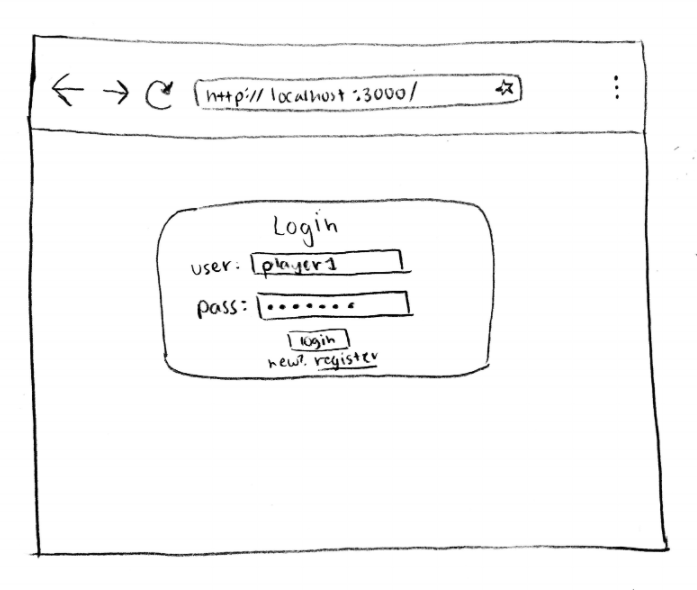
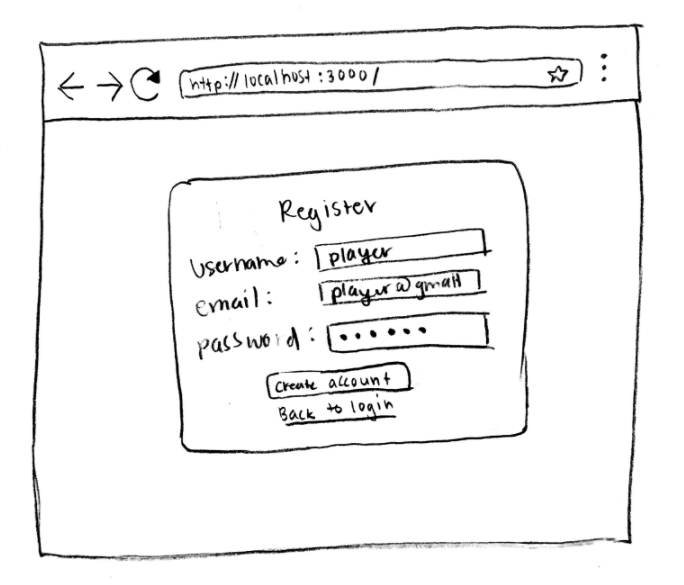
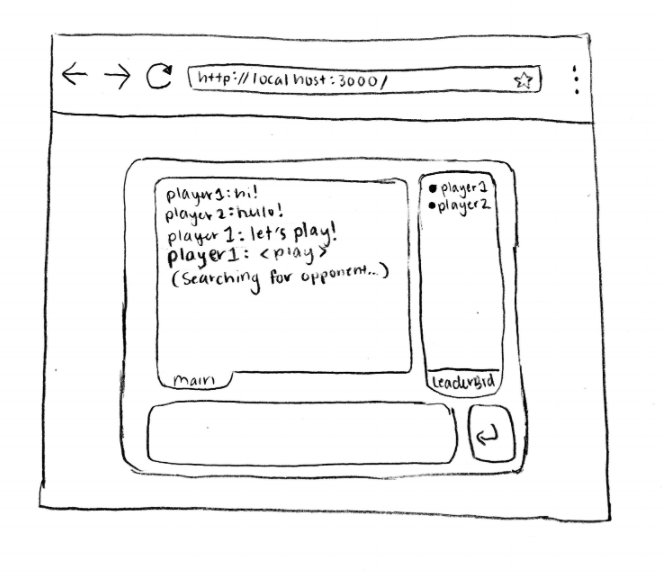
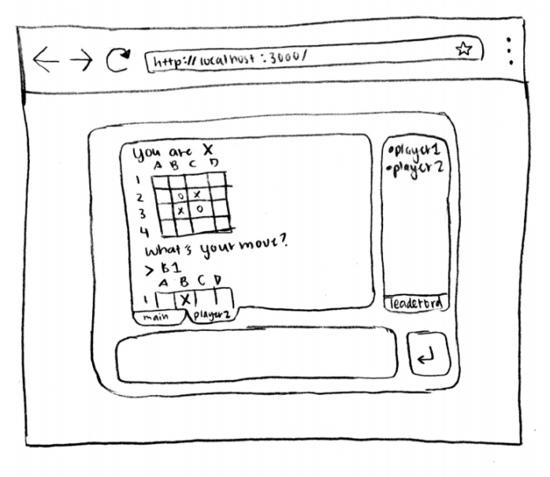
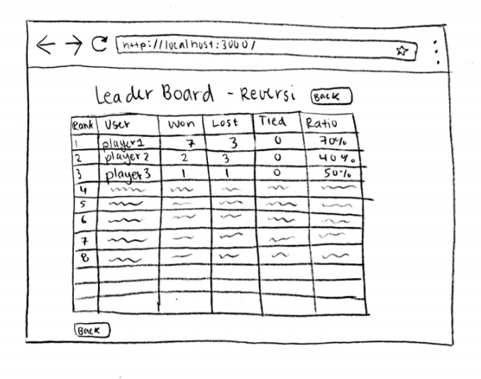
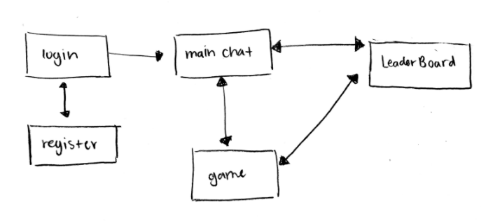

# ReversiChat

## Overview

Sometimes you're bored... and you just want start a conversation with a random stranger or play othello with another person who's bored. This app is the solution to your boredom!

ReversiChat is a web app that will allow you to talk to anyone who logs in the server, and also play reversi with them! Users can register and login. Once they're logged in, they are automatically put in the general chat. Then they have the option of playing othello with one other player online. There's a leaderboard that keeps track of who has the most wins and win percentage in the game.

## Data Model

The application will store Users, Games, and Leaderboard

* Leaderboard has multiple users (via references)
* Games have two users (via references)

An Example User:

```javascript
{
  username: "player1",
  hash: // a password hash,
  email: "playa@gmail.com",
  wins: 3,
  gamesPlayed: 10,
  currentGameInfo: {
    currentGameId: // unique number for game,
    color: // X/O
  }
}
```

An Example Leaderboard:

```javascript
{
  users: // a reference to a set of user objects,
}
```


An Example Game:

```javascript
{
  currentGameId: // unique number for game
  boardState: {
    board: // array with board info
    turn: // whose turn it is X/O
  }
  players: // a reference to two user objects
}
```


## [Link to Commented First Draft Schema](db.js)

## Wireframes

/login - page for logging into chat server



/register - page for making an account



/ - main chat page



/ - page for playing reversi



/leaderboard - shows leaderboard



## Site map



## User Stories or Use Cases

1. as non-registered user, I can register a new account with the site
2. as a user, I can log in to the site
3. as a user, I can chat with other online users
4. as a user, I can view those who are online to see if there's anyone I can play
5. as a user, I can attempt to find an opponent to play
6. as a user, I can view the leaderboard to see who has had the most wins

## Research Topics

* (5 points) Integrate user authentication
    * I'm going to be using passport for user authentication
    * And account has been made for testing; I'll email you the password
* (4 points) Perform client side form validation using a JavaScript library
    * to make sure email is correctly formatted
    * possibly to make sure moves are valid?
* (2 points) Socket.io
    * enables real-time bidirectional event-based communication
    * want to use this to send messages back and forth from client to server to client
11 points total out of 8 required points


## [Link to Initial Main Project File](app.js)

## Annotations / References Used

1. [socket.io](https://socket.io/docs) - (add link to source code that was based on this)
